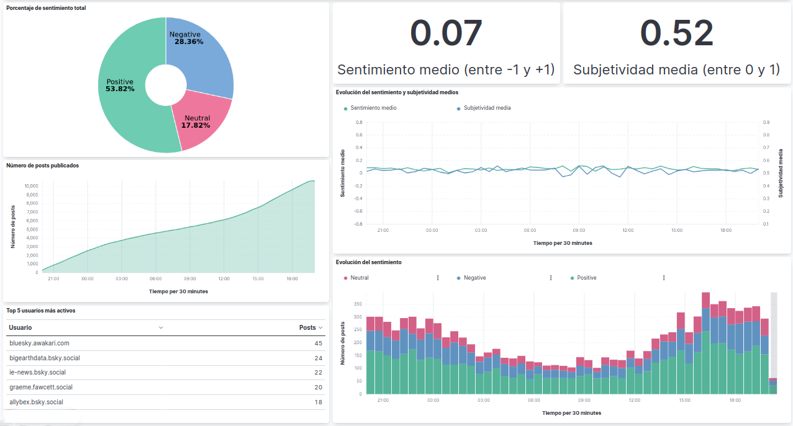

# Automated Emotional Analysis System for Bluesky Posts

An automated infrastructure designed to collect, process and visualize real-time sentiment data from the Bluesky social network about a certain topic. The system utilizes a distributed architecture orchestrated by Ansible and powered by the Elastic Stack.

## Features
* **Collection:** Automated gathering of publications from Bluesky via the AT Protocol.
* **Analysis:** Quantitative sentiment analysis using the TextBlob library.
* **Storage:** Optimized data management and search using Elasticsearch.
* **Visualization:** Dynamic dashboards in Kibana to track trends and statistics.
* **Automation:** Reproducible infrastructure using Ansible to reduce manual configuration.
* **Monitoring and Alerts:** Ensuring system visibility through Nagios Core and automated email notifications for host connectivity.
* **High Availability:** Architecture designed to ensure service continuity even during component failures.

## Interface Preview


## Installation

### Prerequisites
* **Control Node**:
  * Linux-based OS (tested on Debian/Ubuntu)
  * Ansible installed
  * User `controlnode` with sudo privileges
* **Target nodes**:
  * Linux-based OS (tested on Debian/Ubuntu)
  * Python installed
  * SSH access via public key from the Control Node
  * User `endp` with sudo privileges
* A Bluesky account and App Password
* An email account and App Password

### Configuration
1. Clone this repository on the Control Node:
    ```bash
    cd /home/controlnode
    git clone https://github.com/ivrugue/bluesky-emotional-analysis
    cd bluesky-emotional-analysis
    ```
2. **Inventory**: Configure `inventory/instances.txt` with your server IPs and personalized Bluesky queries.

3. **Variables**: Edit the following files:
   * `vars/secrets.yml`: Bluesky and Email app passwords. Once configured, it is highly recommended to encrypt this file using Ansible Vault and store its password in a secure file:
        ```bash
        cp vars/secrets.yml.example vars/secrets.yml
        ansible-vault encrypt vars/secrets.yml
        ```
   * `roles/generator/vars/main.yml`: Bluesky username
   * `roles/monitor/vars/main.yml`: Email variables (SMTP host, port, sender/recipient addresses) and Vault password file

### Deployment
1. **Full Infrastructure Deployment**:
    ```bash
    ansible-playbook -i inventory/instances.txt -u endp -K --vault-password-file <file> playbooks/bluesky.yml -T 30 [--tags <tag>]
    ```
2. **Monitoring and Alerts Setup** (run locally on the Control Node):
    ```bash
    ansible-playbook -u controlnode -K playbooks/start_monitor.yml -T 30
    ```

### Accessing the Interfaces
* **Analysis Dashboard (Kibana)**: Access via Nginx reverse proxy at the frontend node’s IP on port `8080`
  * URL: `http://<frontend_node_ip>:8080`
* **Infrastructure Monitoring (Nagios)**: Access on the Nagios node’s IP under `/nagios4`
  * URL: `http://<nagios_node_ip>/nagios4`


## Architecture
| Component | Technology | Description |
| :--- | :--- | :--- |
| **Automation** | **Ansible** | Manages provisioning and deployment across all nodes. |
| **Log Generator** | **Python + TextBlob** | Fetches posts every 30s and analyzes sentiment/subjectivity. |
| **Data Ingestion** | **Logstash** | Processes JSON logs, transforms fields and routes them to the cluster. |
| **Search Engine** | **Elasticsearch** | A cluster with sharding and replication for resilience. |
| **Visualization** | **Kibana** | Provides real-time dashboards for emotional data analysis. |
| **Reverse Proxy** | **Nginx** | Acts as a high-availability entry point for Kibana. |
| **Monitoring** | **Nagios** | Real-time status tracking for all infrastructure hosts and services. |
| **Alerting System** | **Ansible + SMTP** | Automated health checks via ICMP with email notifications if a node fails. |

### High Availability
The system is designed to maintain operation under partial failures through multiple mechanisms:

- **Distributed and replicated services:** Each component (log generator, Logstash, Elasticsearch, Kibana) can run on multiple nodes to avoid single points of failure.
- **Scalability:** Horizontal scaling by adding nodes also allows the system to maintain performance under growing load.
- **Elasticsearch cluster:** Cluster nodes with replication ensure data is available even if one node fails. Master election and fragment replication provide automatic recovery.
- **Kibana access via reverse proxy:** Multiple Kibana instances are accessible through Nginx, providing a single entry point that automatically routes to active nodes.
- **Automatic service restart:** All services are managed by systemd, guaranteeing local recovery after crashes.